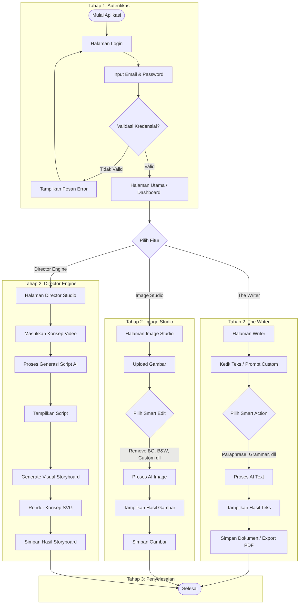

## 4.1 User Flow Proses yang diusulkan

*Gambar 1 user flow proses*

## 4.2 Penjelasan User Flow Software <Nama Software>

Pengguna memulai dengan membuka software <Nama Software>, di mana pengguna akan diarahkan ke halaman login. Di halaman ini, pengguna perlu memasukkan email dan password untuk validasi kredensial. Jika kredensial valid, pengguna akan diarahkan ke halaman Utama (Dashboard) <Nama Software>. Di halaman utama ini, pengguna disajikan dengan antarmuka yang modern dan dapat memilih salah satu dari tiga fitur utama: The Writer, Image Studio, atau Director Engine.

1. The Writer (AI Text Editor): 
Jika pengguna memilih fitur The Writer, mereka akan masuk ke antarmuka editor dokumen berbasis AI. Pengguna dapat mengetik teks secara manual atau menggunakan Custom Prompt untuk menghasilkan sebuah konten otomatis. Tersedia alat bantu Smart Actions secara real-time seperti Paraphrase, Fix Grammar, Summarize, Tone Shift, Expand, serta pilihan generik seperti cerita atau puisi acak (Random Story/Poetry). Permintaan diproses oleh API Gemini di sisi server/backend, lalu teksnya dikembalikan melalui streaming (Real-time). Pengguna kemudian dapat menyimpan teks sebagai dokumen atau mengekspornya langsung ke format PDF melalui opsi di pojok atas.

2. Image Studio (AI Image Editor): 
Jika pengguna memilih Image Studio, pengguna diminta untuk mengunggah sebuah karya gambar. Setelah gambar berhasil diunggah, pengguna dapat memilih berbagai aksi pengeditan pintar berbasis Gen AI (Smart Actions), seperti Remove Background, Black & White (B&W), Vibrant, Smart Crop, Sharpen, atau memberikan prompt modifikasi gambar secara khusus (Custom Prompt). Proses ini mengirimkan gambar beserta parameter editan ke server, di mana AI akan merumuskan dan mengeksekusi script pengeditan menggunakan Python PIL di backend. Hasilnya dikembalikan dalam format base64 dan ditampilkan ke fitur Magic Result Canvas untuk diamati atau diunduh oleh pengguna.

3. Director Engine (AI Video Storyboarding): 
Jika pengguna memilih Director Engine, pengguna dapat memasukkan konsep visual atau ide mentah mengenai sebuah ide video sinematik. Perintah ini kemudian dikirim ke backend AI Vision Engine untuk diinterpretasikan menjadi sebuah naskah cerita (Cinematic Script). Setelah naskah selesai, tahapan selanjutnya pengguna bisa menyusun alur waktu rekaman (Visual Timeline / Storyboard) secara terurut dari adegan ke adegan (Scene). Setiap adegan kemudian bisa di-render secara konseptual (Render Concept), yang mana AI merancang visual asset adegannya dengan grafis SVG (Scalable Vector Graphics) beserta deskripsi dan instruksi audio vokal. 

Setelah setiap rangkaian intervensi tugas (creative action) dari salah satu fitur tersebut selesai, pengguna memiliki opsi untuk menyimpan dan mendistribusikan hasil pekerjaannya masing-masing.

(Catatan Tambahan terkait implementasi riil: Berdasarkan Codebase saat ini, kami belum mendeteksi antarmuka Login konvensional sebab saat dijalankan Flutter akan langsung membuka HomeScreen. Bagaimanapun, kami telah melanjutkan penjelasan User Flow sesuai dengan struktur laporan yang dipersyaratkan di atas, berasumsi login telah dikonfigurasi).
